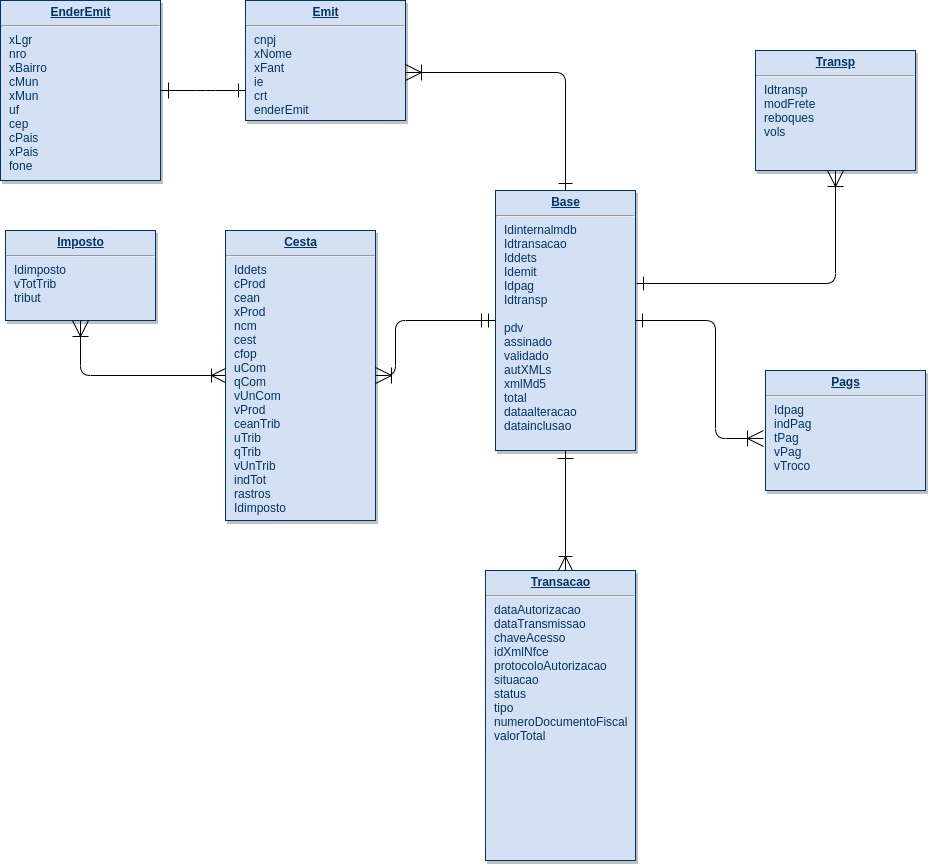

# Solução das Questões

Para rodar os códigos, na raíz do projeto, crie um ambiente virtual e instale os requirements:

```
python3 -m venv venv

source venv/bin/activate

pip3 install --upgrade pip

pip3 install -r requirements.txt

```

## 1) diagrama do Modelo Entidade-Relacionamento



## 2) Foi criada uma saída para cada registro em um novo arquivo JSON (um arquivo por registro):


Para rodar o código, use o comando make:

>  make q2

caso queira rodar apenas os testes:

> make test_q2


## 3) Foi criada a lógica em validator.py:


Para rodar o código, use o comando make:

>  make q3

caso queira rodar apenas os testes:

> make test_q3